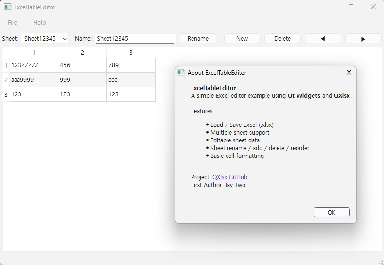

# QXlsx Examples

---

## [HelloWorld](https://github.com/QtExcel/QXlsx/tree/master/HelloWorld)

- Hello world example

```cpp
// main.cpp

#include <QtGlobal>
#include <QCoreApplication>
#include <QtCore>
#include <QVariant>
#include <QDebug>

#include <iostream>
using namespace std;

// [0] include QXlsx headers 
#include "xlsxdocument.h"
#include "xlsxchartsheet.h"
#include "xlsxcellrange.h"
#include "xlsxchart.h"
#include "xlsxrichstring.h"
#include "xlsxworkbook.h"
using namespace QXlsx;

int main(int argc, char *argv[])
{
    QCoreApplication app(argc, argv);

    int row = 1; int col = 1;
	
    // [1]  Writing excel file(*.xlsx)
    QXlsx::Document xlsxW;
	QVariant writeValue = QString("Hello Qt!");
    xlsxW.write(row, col, writeValue); // write "Hello Qt!" to cell(A,1).
    xlsxW.saveAs("Test.xlsx"); // save the document as 'Test.xlsx'

    // [2] Reading excel file(*.xlsx)
    Document xlsxR("Test.xlsx"); 
    if (xlsxR.load()) // load excel file
    { 
        Cell* cell = xlsxR.cellAt(row, col); // get cell pointer.
        if ( cell != NULL )
        {
            QVariant var = cell->readValue(); // read cell value (number(double), QDateTime, QString ...)
            qDebug() << var; // display value. it is 'Hello Qt!'.
        }
    }

    return 0;
}
```

<br />

---

## [TestExcel](https://github.com/QtExcel/QXlsx/tree/master/TestExcel)

- :zap: Basic examples (based on QtXlsx examples)
    - [calendar](https://github.com/QtExcel/QXlsx/blob/master/TestExcel/calendar.cpp)
    - [chart](https://github.com/QtExcel/QXlsx/blob/master/TestExcel/chart.cpp)
    - [chart sheet](https://github.com/QtExcel/QXlsx/blob/master/TestExcel/chartsheet.cpp)
    - [data validation](https://github.com/QtExcel/QXlsx/blob/master/TestExcel/datavalidation.cpp)
    - [demo](https://github.com/QtExcel/QXlsx/blob/master/TestExcel/demo.cpp)
    - [document property](https://github.com/QtExcel/QXlsx/blob/master/TestExcel/documentproperty.cpp)
    - [extract data](https://github.com/QtExcel/QXlsx/blob/master/TestExcel/extractdata.cpp)
    - [formula](https://github.com/QtExcel/QXlsx/blob/master/TestExcel/formulas.cpp)
    - [hyperlink](https://github.com/QtExcel/QXlsx/blob/master/TestExcel/hyperlinks.cpp)
    - [image](https://github.com/QtExcel/QXlsx/blob/master/TestExcel/image.cpp)
    - [merge cells](https://github.com/QtExcel/QXlsx/blob/master/TestExcel/mergecells.cpp)
    - [number format](https://github.com/QtExcel/QXlsx/blob/master/TestExcel/numberformat.cpp)
    - [page margins](https://github.com/QtExcel/QXlsx/blob/master/TestExcel/pageMargins.cpp)
    - [read style](https://github.com/QtExcel/QXlsx/blob/master/TestExcel/readStyle.cpp)
    - [richtext](https://github.com/QtExcel/QXlsx/blob/master/TestExcel/richtext.cpp)
    - [row column](https://github.com/QtExcel/QXlsx/blob/master/TestExcel/rowcolumn.cpp)
    - [style](https://github.com/QtExcel/QXlsx/blob/master/TestExcel/style.cpp)
    - [worksheet operations](https://github.com/QtExcel/QXlsx/blob/master/TestExcel/worksheetoperations.cpp)


<br />

---

## [HelloAndroid](https://github.com/QtExcel/QXlsx/tree/master/HelloAndroid)

- See 'HelloAndroid' example using QML and native C++.

- Qt 5.11.1 / gcc 4.9 / QtCreator 4.6.2 
- Android x86 (using Emulator <Android Oreo / API 26>)
- Android Studio 3.1.3 (Android NDK 17.1)


<br />

---

## [WebServer](https://github.com/QtExcel/QXlsx/tree/master/WebServer)
- Load xlsx file and display on Web.
	- Connect to `http://127.0.0.1:3001` 
- C++ 14(17) is required. Old compilers is not supported.


<br />

---

## [ShowConsole](https://github.com/QtExcel/QXlsx/tree/master/ShowConsole)
- Load xlsx file and display in console.
  - [Usage] ShowConsole *.xlsx
- C++ 11 is required. Old compilers is not supported.


<br />

---

## [ReadColor](https://github.com/QtExcel/QXlsx/tree/master/ReadColor) 
- Read cell color


<br />

---

## [csv](https://github.com/QtExcel/QXlsx/tree/master/csv)
- Save the `xlsx` file as a `csv` file.
```cpp
        QString xlsxFileName = ":/test.xlsx";
        QXlsx::Document xlsxDoc(xlsxFileName);
        if (!xlsxDoc.isLoadPackage()) {
            return 0; // failed to load
        }

        QString csvFileName = "hello.csv";
        if ( xlsxDoc.saveAsCsv(csvFileName) ){
            qDebug() << "save as csv file";
        }
```

<br />

---

## [ExcelViewer](https://github.com/QtExcel/QXlsx/tree/master/ExcelViewer)
- Load xlsx file and display on Qt widgets. 


<br />

---

## XlsxFactory 
- Load xlsx file and display on Qt widgets. 
- Moved to personal repository for advanced app.
	- https://j2doll.tistory.com/654
	- The source code of this program cannot be released because it contains a commercial license.


<br />

---

## [LargeData](https://github.com/QtExcel/QXlsx/tree/master/LargeData)
- `LargeData` example demonstrates how to efficiently generate, write, and read large Excel `.xlsx` files using `QXlsx`.
- It showcases:
   - Writing a large dataset (hundreds of thousands of rows)
   - Optional cell formatting
   - Splitting data across multiple sheets
   - Time-stamped progress reporting (0.1% increments)
   - Verification of selected sample cells after writing
   - Command-line configurability (rows, columns, sheet size, etc.)
- This example is useful for testing performance, benchmarking, and validating QXlsx behavior with big data workloads.

- Command-Line Usage
   - The program accepts several optional parameters:

| Option                      | Description                           | Default    |
| --------------------------- | ------------------------------------- | ---------- |
| `--rows <n>` `-r <n>`       | Number of rows to generate            | `100000`   |
| `--cols <n>` `-c <n>`       | Number of columns to generate         | `10`       |
| `--use-style` `-s`          | Apply simple cell formatting          | *Disabled* |
| `--sheet-rows <n>` `-S <n>` | Max rows per sheet (0 = single sheet) | `0`        |

- Examples

```
LargeData --rows 200000 --cols 20
   Generate 200,000 rows × 20 columns
   
LargeData -r 100000 -c 10 --use-style
   Apply cell formatting   

LargeData -r 200000 -c 10 -S 50000
   Split into multiple sheets (50,000 rows per sheet)

LargeData -r 300000 -c 15 -S 60000 --use-style
   All options combined   
```

<br />

---

## [ExcelTableEditor](https://github.com/QtExcel/QXlsx/tree/master/ExcelTableEditor)



- Load Excel files with `multiple sheets`
- Display sheet contents in a `QTableView`
- Edit all cells (including row 1)
- Boolean values displayed as checkboxes
- Read & preserve basic cell formatting (font, alignment, colors)
- Sheet operations:
  - Rename sheet
  - Add new sheet
  - Delete sheet
  - Reorder sheets (move left/right)
- Save or Save As to produce a modified workbook

<br />

---

## [sax reader](https://github.com/QtExcel/QXlsx/blob/j2doll/sax_reader/TestExcel/extractdata_sax.cpp)

- How to use sax parser that uses less RAM memory.

```cpp
void dump_all_sheets_sax(QXlsx::Document& doc)
{
    QXlsx::sax_options opt;
    opt.resolve_shared_strings = true;     // If there are many strings, set to false to save more RAM (but sharedString index may be output instead)
    opt.read_formulas_as_text  = true;     // Output formula as string instead of result value (set false if not needed)
    opt.stop_on_empty_sheetdata = false;   // Continue even if sheetData is empty

    const QStringList sheets = doc.sheetNames();
    qInfo() << "sheet count:" << sheets.size();

    for (const QString& sheet_name : sheets) {
        qInfo().noquote() << "\n=== SHEET:" << sheet_name << "===";

        const bool ok = doc.read_sheet_sax(
            sheet_name,
            opt,
            [&](const QXlsx::sax_cell& cell) -> bool {
                qDebug().noquote()
                << QString("%1!R%2C%3 = %4")
                        .arg(cell.sheet_name)
                        .arg(cell.row)
                        .arg(cell.col)
                        .arg(cell.value.toString());
                return true; // continue
            });

        qInfo() << "sheet done:" << sheet_name << "ok=" << ok;
    }
}
```

<br />

---

## [FormulaDump](https://github.com/QtExcel/QXlsx/tree/master/FormulaDump)

- Run
   - The main executable allows you to dump formulas and values from an XLSX file. Example usage:
   ```sh
   ./FormulaDump <xlsx-file> [options]
   ```

- Options
   - `--sheet <name>`: Dump only the specified sheet
   - `--all`: Dump all sheets
   - `--only-formula`: Output only formula cells
   - `--show-value`: Output cell values
   - `--eval-formula`: Evaluate formulas if no cached value
   - `--max-rows <n>`: Limit the number of rows
   - `--max-cols <n>`: Limit the number of columns
   - `--print-empty`: Print cells even if the value is empty

- Formula
   - Only some formulas are supported. 
      - `+`, `-`, `SUM`, `AVERAGE`, `MIN`, `MAX`
   - For more information, see [`mini_formula_evaluator.cpp`](https://github.com/QtExcel/QXlsx/blob/master/FormulaDump/mini_formula_evaluator.cpp).

---

