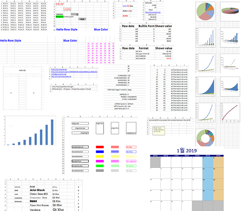
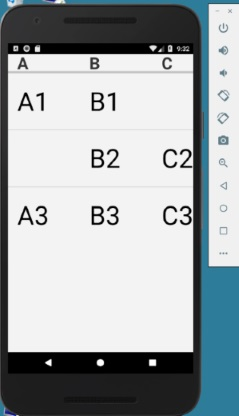
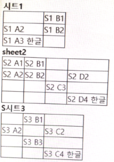
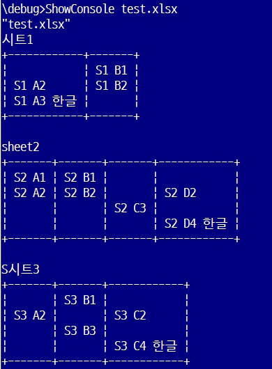
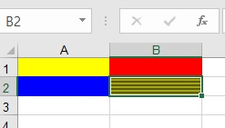
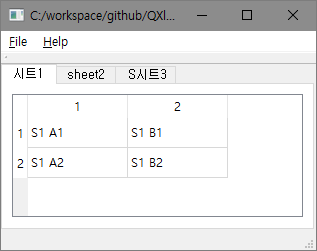
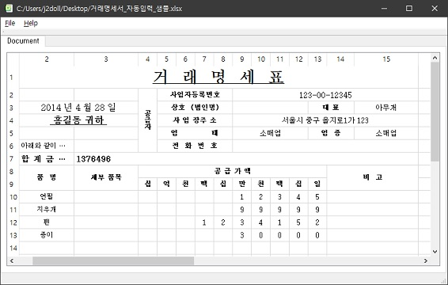

# QXlsx Examples

## [HelloWorld](https://github.com/QtExcel/QXlsx/tree/master/HelloWorld)

- Hello world example

```cpp
// main.cpp

#include <QtGlobal>
#include <QCoreApplication>
#include <QtCore>
#include <QVariant>
#include <QDebug>

#include <iostream>
using namespace std;

// [0] include QXlsx headers 
#include "xlsxdocument.h"
#include "xlsxchartsheet.h"
#include "xlsxcellrange.h"
#include "xlsxchart.h"
#include "xlsxrichstring.h"
#include "xlsxworkbook.h"
using namespace QXlsx;

int main(int argc, char *argv[])
{
    QCoreApplication app(argc, argv);

    int row = 1; int col = 1;
	
    // [1]  Writing excel file(*.xlsx)
    QXlsx::Document xlsxW;
	QVariant writeValue = QString("Hello Qt!");
    xlsxW.write(row, col, writeValue); // write "Hello Qt!" to cell(A,1).
    xlsxW.saveAs("Test.xlsx"); // save the document as 'Test.xlsx'

    // [2] Reading excel file(*.xlsx)
    Document xlsxR("Test.xlsx"); 
    if (xlsxR.load()) // load excel file
    { 
        Cell* cell = xlsxR.cellAt(row, col); // get cell pointer.
        if ( cell != NULL )
        {
            QVariant var = cell->readValue(); // read cell value (number(double), QDateTime, QString ...)
            qDebug() << var; // display value. it is 'Hello Qt!'.
        }
    }

    return 0;
}
```

## [TestExcel](https://github.com/QtExcel/QXlsx/tree/master/TestExcel)

- :zap: Basic examples (based on QtXlsx examples)
    - [calendar](https://github.com/QtExcel/QXlsx/blob/master/TestExcel/calendar.cpp)
    - [chart](https://github.com/QtExcel/QXlsx/blob/master/TestExcel/chart.cpp)
    - [chart sheet](https://github.com/QtExcel/QXlsx/blob/master/TestExcel/chartsheet.cpp)
    - [data validation](https://github.com/QtExcel/QXlsx/blob/master/TestExcel/datavalidation.cpp)
    - [demo](https://github.com/QtExcel/QXlsx/blob/master/TestExcel/demo.cpp)
    - [document property](https://github.com/QtExcel/QXlsx/blob/master/TestExcel/documentproperty.cpp)
    - [extract data](https://github.com/QtExcel/QXlsx/blob/master/TestExcel/extractdata.cpp)
    - [formula](https://github.com/QtExcel/QXlsx/blob/master/TestExcel/formulas.cpp)
    - [hyperlink](https://github.com/QtExcel/QXlsx/blob/master/TestExcel/hyperlinks.cpp)
    - [image](https://github.com/QtExcel/QXlsx/blob/master/TestExcel/image.cpp)
    - [merge cells](https://github.com/QtExcel/QXlsx/blob/master/TestExcel/mergecells.cpp)
    - [number format](https://github.com/QtExcel/QXlsx/blob/master/TestExcel/numberformat.cpp)
    - [page margins](https://github.com/QtExcel/QXlsx/blob/master/TestExcel/pageMargins.cpp)
    - [read style](https://github.com/QtExcel/QXlsx/blob/master/TestExcel/readStyle.cpp)
    - [richtext](https://github.com/QtExcel/QXlsx/blob/master/TestExcel/richtext.cpp)
    - [row column](https://github.com/QtExcel/QXlsx/blob/master/TestExcel/rowcolumn.cpp)
    - [style](https://github.com/QtExcel/QXlsx/blob/master/TestExcel/style.cpp)
    - [worksheet operations](https://github.com/QtExcel/QXlsx/blob/master/TestExcel/worksheetoperations.cpp)



## [HelloAndroid](https://github.com/QtExcel/QXlsx/tree/master/HelloAndroid)

- See 'HelloAndroid' example using QML and native C++.

- Qt 5.11.1 / gcc 4.9 / QtCreator 4.6.2 
- Android x86 (using Emulator <Android Oreo / API 26>)
- Android Studio 3.1.3 (Android NDK 17.1)



## [WebServer](https://github.com/QtExcel/QXlsx/tree/master/WebServer)
- Load xlsx file and display on Web.
	- Connect to `http://127.0.0.1:3001` 
- C++ 14(17) is required. Old compilers is not supported.



## [ShowConsole](https://github.com/QtExcel/QXlsx/tree/master/ShowConsole)
- Load xlsx file and display in console.
  - [Usage] ShowConsole *.xlsx
- C++ 11 is required. Old compilers is not supported.



## [ReadColor](https://github.com/QtExcel/QXlsx/tree/master/ReadColor) 
- Read cell color



## XlsxFactory 
- Load xlsx file and display on Qt widgets. 
- Moved to personal repository for advanced app.
	- https://j2doll.tistory.com/654
	- The source code of this program cannot be released because it contains a commercial license.




## [csv](https://github.com/QtExcel/QXlsx/tree/master/csv)
- Save the `xlsx` file as a `csv` file.
```cpp
        QString xlsxFileName = ":/test.xlsx";
        QXlsx::Document xlsxDoc(xlsxFileName);
        if (!xlsxDoc.isLoadPackage()) {
            return 0; // failed to load
        }

        QString csvFileName = "hello.csv";
        if ( xlsxDoc.saveAsCsv(csvFileName) ){
            qDebug() << "save as csv file";
        }
```


