## 如何设置 QXlsx 项目

> *以其他语言阅读: [English](HowToSetProject.md), [한국어](HowToSetProject.ko.md), [简体中文](HowToSetProject.zh-CN.md)*

- 以下是应用 QXlsx 的简单方法。
- 本文适用于使用 qmake 构建项目。若使用 CMake，请参考 [English文档](HowToSetProject-cmake.md) 或 [中文文档](HowToSetProject-cmake.zh-CN.md).
- 以下步骤基于 Windows 系统，Linux 或 macOS 的流程类似。
- 在 Linux 或 Mac 上应用它的方法是类似的，- 如有特殊需求，我会补充说明或提供帮助。
- * Hi! I'm j2doll. My native language is not English and my English is not fluent. Please understand. :-)

## 设置步骤

:one: 从 github 克隆源代码

```sh
git clone https://github.com/j2doll/QXlsx.git
```

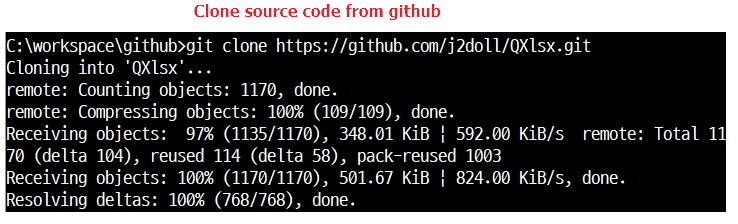

<br /><br />

:two: 启动 Qt Creator

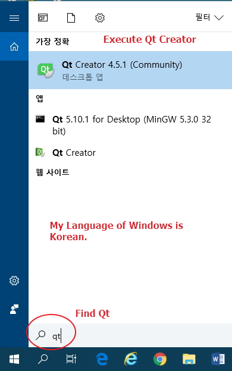

* Qt Creator 使用指南。 [官方文档](https://www.qt.io/qt-features-libraries-apis-tools-and-ide/)

<br /><br />

:three: 创建一个新的 Qt 项目。

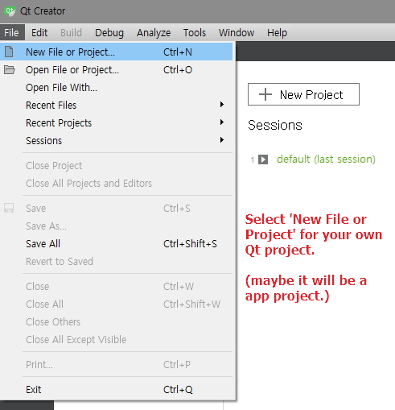

<br /><br />

:four: 本示例为控制台应用程序。

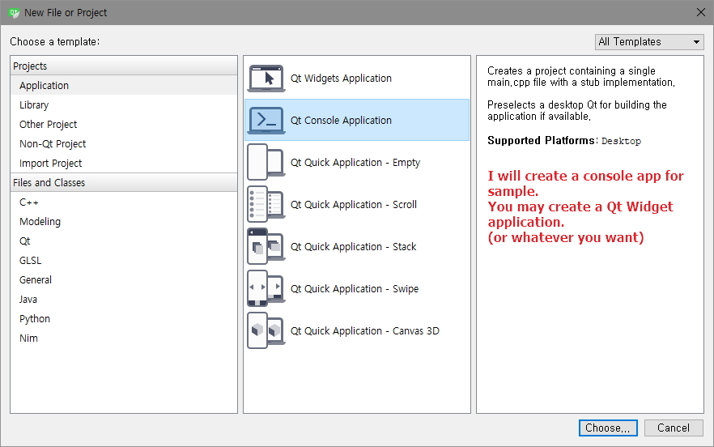

<br /><br />

:five: 设置项目名称（示例：HelloQXlsx）。 

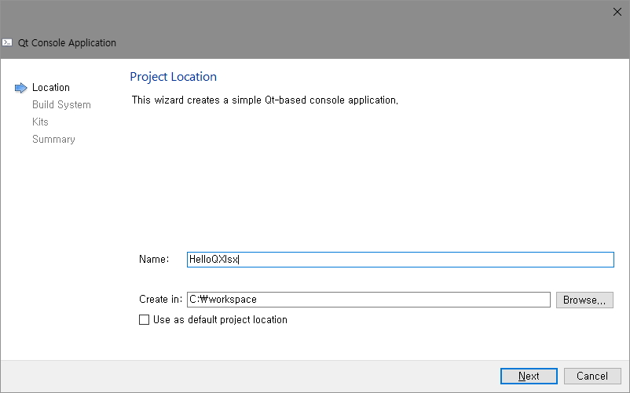

<br /><br />

:six: HelloQXlsx 项目创建完成。

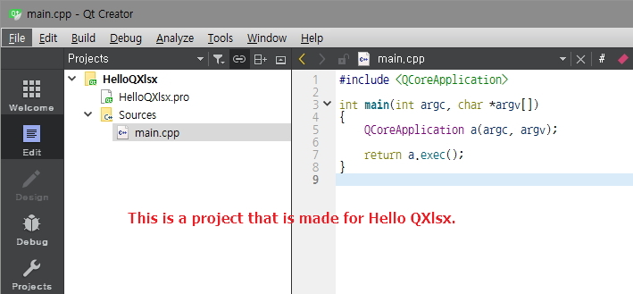

<br /><br />

:seven: 查看项目目录结构

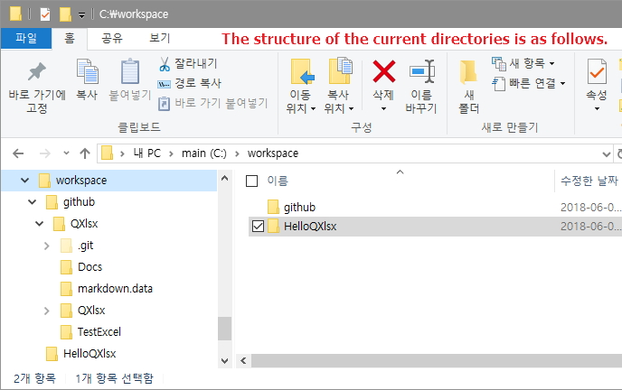

<br /><br />

:eight: 复制 QXlsx 到项目目录 

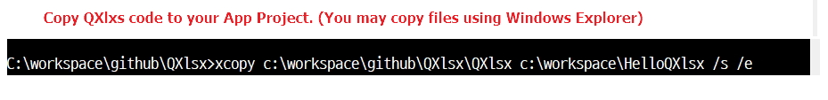

```cmd
xcopy c:\workspace\github\QXlsx\QXlsx c:\workspace\HelloQXlsx /s /e

> 将 QXlsx 源码复制到你的 Qt 项目中（请根据你本机路径修改）
```

<br /><br />

:nine: 项目的当前目录和文件

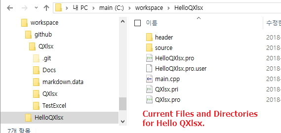

<br /><br />

:keycap_ten: 在Qt项目文件(`*.pro`)中添加 QXlxs 库的代码

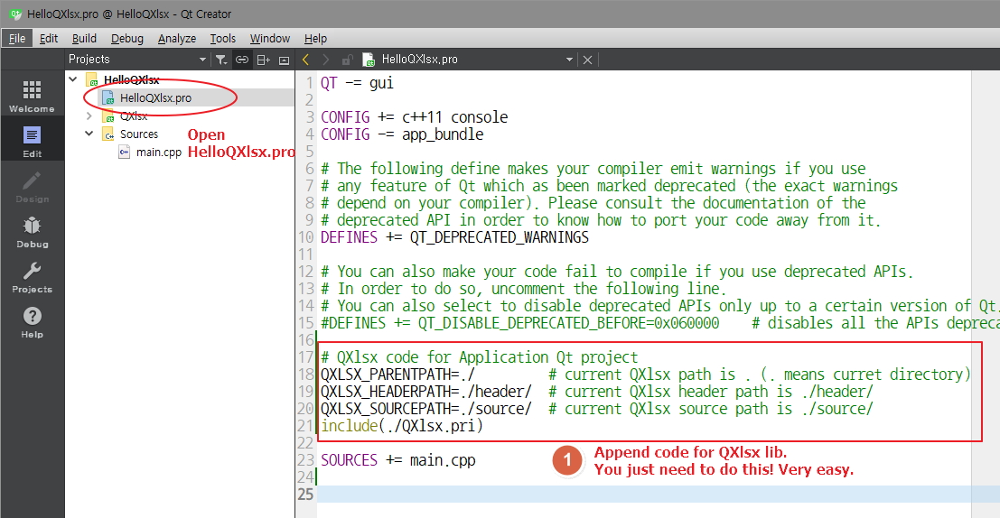

```qmake
# QXlsx code for Application Qt project
QXLSX_PARENTPATH=./         # current QXlsx path is . (. means curret directory)
QXLSX_HEADERPATH=./header/  # current QXlsx header path is ./header/
QXLSX_SOURCEPATH=./source/  # current QXlsx source path is ./source/
include(./QXlsx.pri)
```

<br /><br />

:one::one: 设置示例的头文件和命名空间。然后附加 hello world 代码。

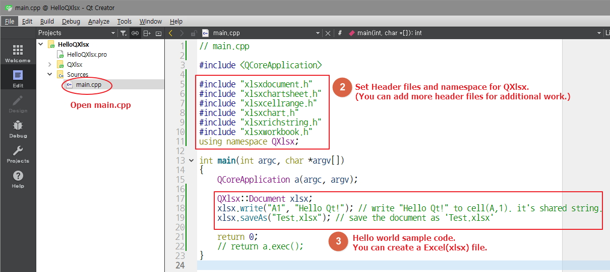

```cpp
// main.cpp

#include <QCoreApplication>

#include "xlsxdocument.h"
#include "xlsxchartsheet.h"
#include "xlsxcellrange.h"
#include "xlsxchart.h"
#include "xlsxrichstring.h"
#include "xlsxworkbook.h"
using namespace QXlsx;

int main(int argc, char *argv[])
{
    QCoreApplication a(argc, argv);

    QXlsx::Document xlsx;
    xlsx.write("A1", "Hello Qt!"); // write "Hello Qt!" to cell(A,1). it's shared string.
    xlsx.saveAs("Test.xlsx"); // save the document as 'Test.xlsx'

    return 0;
    // return a.exec();
}
```

<br /><br />

:one::two: 构建并运行项目

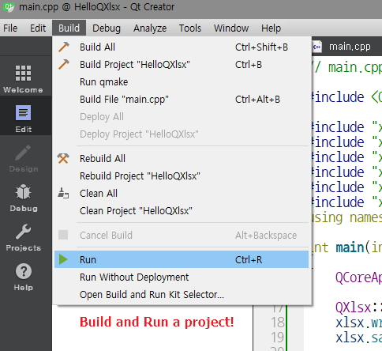

<br /><br />

:one::three: 生成可执行文件(`*.exe`)和Excel文件(`.xlsx`)。

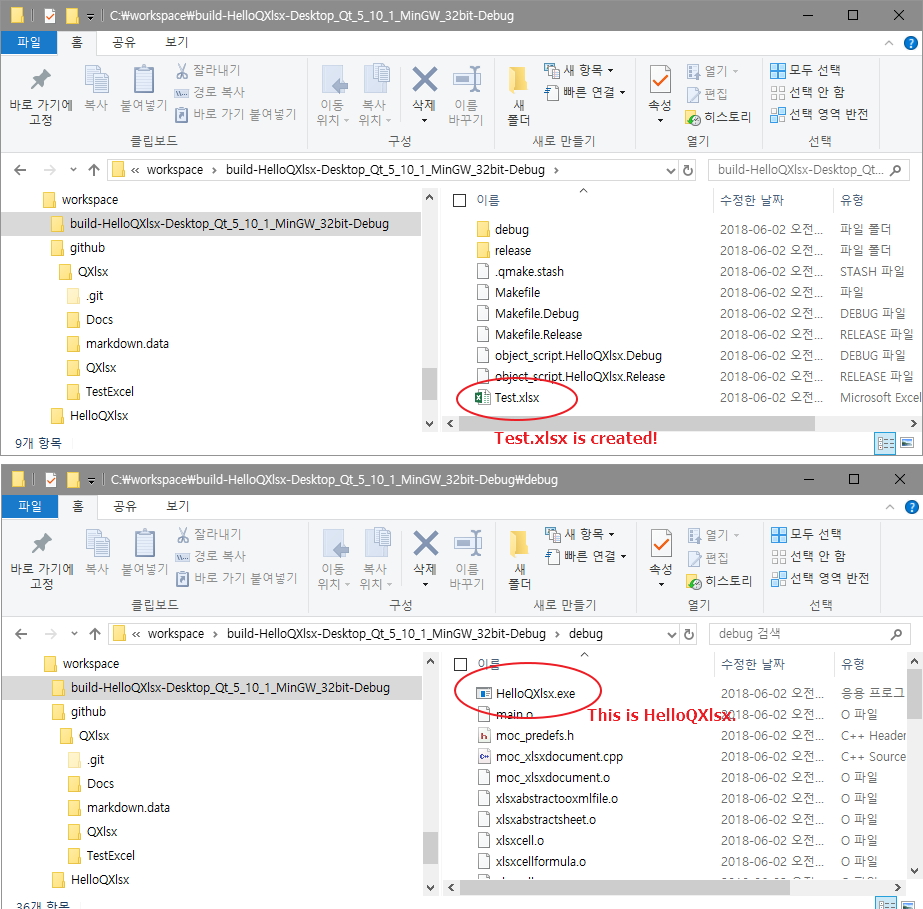

<br /><br />


