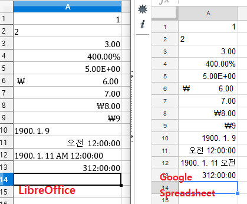

# QXlsx

> *Read this in other languages: [English](README.md), [한국어](README.ko.md)*


## 엑셀 읽기/쓰기 라이브러리
* QXlsx는 엑셀 파일(*.xlsx)을 읽고 쓰는 라이브러리입니다.
  * QtXlsx가 더이상 지원되지 않기 때문에, QtXlsx에 기반한 새로운 프로젝트를 만들었습니다.
  * QXlsx는 개발언어로 C++를 사용합니다.
  * QXlsx는 Qt 5.x를 사용하는 정적 라이브러리로 제작되었습니다. (2017)

  

## 라이선스
* QXlsx는 MIT 라이선스를 사용합니다 : https://opensource.org/licenses/MIT
* QtXlsx 라이선스는 Debao Zhang(2014) 싸이트를 참조하십시오.  https://github.com/dbzhang800/QtXlsxWriter
* Qt 라이선스는 Qt Company 싸이트를 참조하십시오. https://www.qt.io/developers/

## 활용 예제 (Hello excel)

### 엑셀 파일 쓰기 예제
```cpp
QXlsx::Document xlsx;
xlsx.write("A1", "Hello Qt!"); // 셀(A,1)에 'Hello Qt!'값을 설정. 공유 문자열 타입으로 설정됨.
xlsx.saveAs("Test.xlsx"); // 'Test.xlsx'라는 이름으로 엑셀 파일을 저장.
```

### 엑셀 파일 읽기 예제
```cpp
Document xlsx("Test.xlsx"); // 엑셀 파일 읽기
if (!xlsx.isLoadPackage()) { // 엑셀 파일 읽기 실패
	return;
}
int row = 1; int col = 2;
Cell* cell = xlsx.cellAt(row, col); // Cell의 pointer를 얻음 (행(row)는 1번째, 열(column)은 2번째)
if ( cell == NULL )
	continue; // 해당 행렬의 cell값이 설정되어 있지 않음
QVariant var = cell->readValue(); // 셀값을 읽음 (숫자(double), 날자(QDateTime), 문자열(QString) ...)
qint32 styleNo = cell->styleNumber(); // 셀의 스타일 번호를 읽음
if ( styleNo >= 0 )
	qDebug() << row << " " << var << " , style:" << styleNo;
else
	qDebug() << row << " " << var;
```

## 빌드하는 방법
* Qt 5 설치. [Qt Company](https://www.qt.io) (2017-)
* github 소스 코드 클론
```sh
  git clone https://github.com/j2doll/QXlsx.git
```
* QXlsx 프로젝트 빌드
```sh
  cd QXlsx
  qmake QXlsx.pro
  make
```
* HelloExample 빌드
```sh
  cd HelloExcel
    Fix HelloExcel.pro for your own build environment 
  qmake HelloExcel.pro
  make
```
* HelloExample 실행
```sh
 ./HelloExample
```

## 테스트 환경
테스트된 환경은 다음과 같습니다.
- 5.9.2 (MingW/Windows 32bit)
- Qt 5.9.1 (Visual Studio 2017/Windows 64bit)
- Qt 5.9.1 (Visual Studio 2017/Windows 32bit)
- Qt 5.9.1 (MingW/Windows 32bit)
- Qt 5.9.1 (Ubuntu 16/Linux x64)
- Qt 5.6.0 (MingW/Windows 32bit)
- Qt 5.5.1 (MingW/Windows 32bit)
- Qt 5.5.0 (Ubuntu 17/Linux i686)
- Qt 5.2.0 (Ubuntu 14/Linux x64)
- Qt 5.0.1 (MingW/Windows 32bit)

## 테스트 할 일
다음과 같은 테스트들이 수행되어야 합니다.
- 마이크로소프트 엑셀
- 구글 스프레드쉬트
- 리브레오피스 캘크 스프레드시트



## 문의
* j2doll@gmail.com
